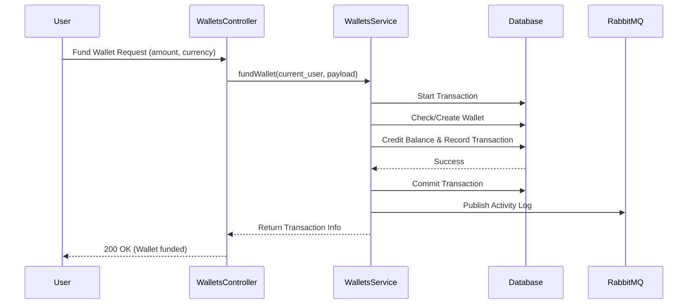
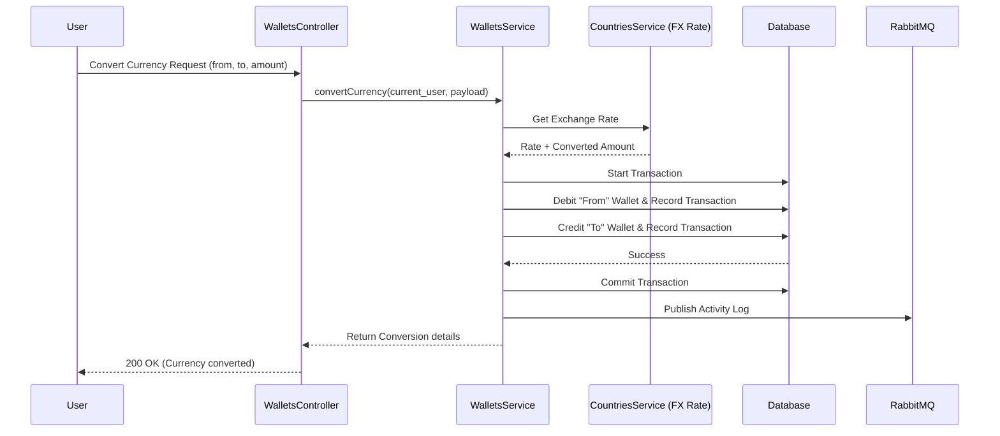
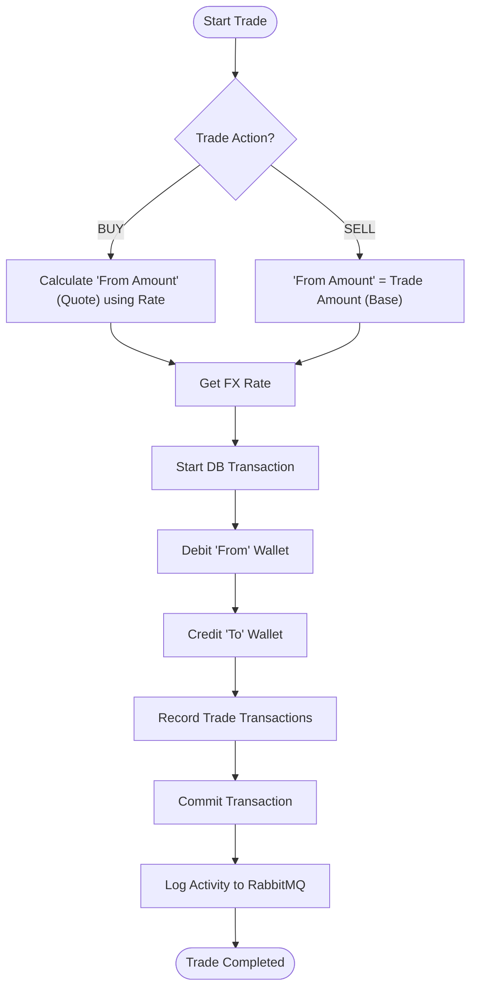

# FX Trading API

## Description

Comprehensive FX Trading API built with NestJS, providing functionalities for currency exchange, wallet management, trading, and user/admin administration.

## Setup Instructions

### Prerequisites

- Node.js (v18 or higher)
- Yarn or NPM
- PostgreSQL
- RabbitMQ
- Redis

### Installation

1. Clone the repository:
   ```bash
   git clone <https://github.com/solomon-prosperity/fx-trading-api.git>
   cd fx_trading_api
   ```
2. Install dependencies:
   ```bash
   yarn install
   ```
3. Environment Configuration:

   - Copy `.env.template` to `.env`.
   - Fill in the required environment variables (Database, RabbitMQ, Redis, JWT, Zeptomail, and Currency API details).

4. Database Setup:

   ```bash
   yarn migrate
   ```

5. Seed Data:
   The application automatically seeds default roles, permissions, and initial admin on startup.

### Running the App

```bash
# development
$ yarn start:dev

# production mode
$ yarn start:prod
```

### Running Tests

```bash
# unit tests
$ yarn test

# test coverage
$ yarn test:cov

# e2e tests
$ NODE_ENV=test yarn test:e2e
```

## Key Assumptions

- **Email Verification**: Users are required to verify their email addresses before they can perform financial transactions (funding, converting, trading).
- **Exchange Rates**: Exchange rates are fetched from an external API and cached/updated via a scheduled cron job (`EXCHANGE_RATE_CRON_SCHEDULE`).
- **Transaction Consistency**: All financial operations (funding, converting, trading) are wrapped in database transactions to ensure data integrity.
- **Role-Based Access Control**: Fine-grained permissions are enforced for both administrators using dedicated guards.
- **Currency Denomination**: All currency amounts (inputs and outputs) are handled in their **lowest denomination** (e.g., kobo for NGN, cents for USD) to avoid floating-point inaccuracies.

## API Documentation

The API documentation is automatically generated using Swagger. Once the application is running, you can access it at:

- **Swagger UI**: `http://localhost:3000/api-docs` (replace `3000` with your `HTTP_PORT`).

## Architectural Decisions

- **Framework**: [NestJS](https://nestjs.com/) was selected for its modular architecture, scalability, and robust ecosystem, facilitating clean and maintainable code.
- **ORM**: [TypeORM](https://typeorm.io/) is used for database interactions, offering excellent TypeScript support and a powerful migration system.
- **Authentication**: Implemented using JWT (JSON Web Tokens) with [Passport.js](http://www.passportjs.org/), ensuring secure and stateless authentication across the API.
- **Asynchronous Processing**: [RabbitMQ](https://www.rabbitmq.com/) handles background tasks, such as sending email notifications, audit logging, improving system responsiveness.
- **Email Service**: [Zoho Zeptomail](https://www.zoho.com/zeptomail/) is used for reliable transactional email delivery.
- **Caching**: [Redis](https://redis.io/) is integrated for caching frequently accessed data and optimizing overall performance.
- **Global Pipes and Filters**: Standardized validation and error handling are implemented via global pipes and an all-exceptions filter, providing a consistent API interface.
- **Response Transformation**: An interceptor is used to normalize API responses, ensuring a uniform data structure for the frontend.

## Core Process Flows

### Wallet Funding



### Currency Conversion



### Trading Logic (Buy/Sell)



---

### Author

- **Prosper Eravwuvieke**
- [LinkedIn Profile](https://www.linkedin.com/in/prosper-eravwuvieke/)

### License

This project is [UNLICENSED](LICENSE).
